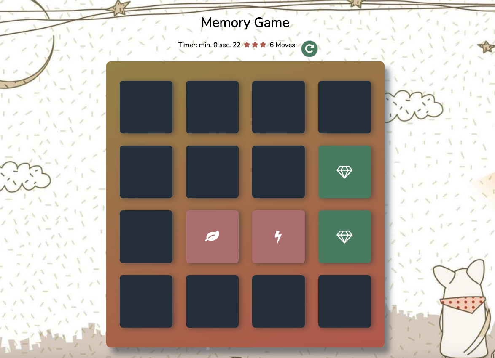

#FEND Udacity - Memory Game Project 
- What is the Memory Game?
A single page web app with the classic memory game. 

- Challenge
Match all cards in less time with less moves.

##Preview

###Development Strategy: 
####Memory Game Logic

The game randomly shuffles the cards. A user wins once all cards have successfully been matched.

- Congratulations Popup

When a user wins the game, a modal appears to congratulate the player and ask if they want to play again. 

- Restart Button

A restart button allows the player to reset the game board, the timer, and the star rating.

- Star Rating

The game displays a star rating (from 1 to at least 3) that reflects the player's performance. At the beginning of a game, it displays 3 stars. After 16  moves, it changes to a lower star rating. After 22 moves, changes to a 1 star rating.

- Timer

When the player starts a game, a displayed timer starts. Once the player wins the game, the timer stops.

- Move Counter

Game displays the current number of moves a user has made.

- Flip a card
Onclick function reveals a card, adds it to an array of open cards them checks if matck.

## Code
Manipulating the DOM with Vanilla JS, altered the HTML and styled the game.

created a deck of cards that shuffles when game is refreshed
created a counter to count the number of moves made by player and timer to know the duration of a play
added effects to cards when they match and are unmatched
create a pop-up modal when player wins game